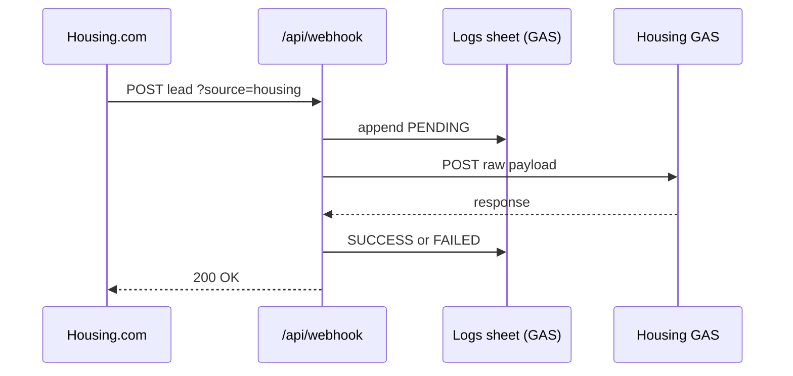

# Lead Redirector

Permanent webhook middleman for property portals (Housing.com, MagicBricks, etc.). Portals POST to a **fixed Vercel URL**; your app logs the lead, then forwards it to the correct Google Apps Script (GAS) URL. When you redeploy GAS, you only update env vars — not the portal.

## Flow



## Portal URLs (give these to Housing — never change)

After deploy, replace the host with your Vercel domain:

- Housing: `https://YOUR_APP.vercel.app/api/webhook?source=housing`
- MagicBricks: `https://YOUR_APP.vercel.app/api/webhook?source=magicbricks`

## Supabase setup (lead storage)

1. Create a project at [supabase.com](https://supabase.com).
2. **SQL Editor** → run `supabase/schema.sql`.
3. **Project Settings → API** → copy:
   - **Project URL** → `SUPABASE_URL`
   - **service_role** key (secret) → `SUPABASE_SERVICE_ROLE_KEY`  
     Never put the service role key in frontend code or `VITE_*` vars.

4. Add both to `.env` and Vercel env, restart `npm run dev`.

Leads from webhooks are stored in the `leads` table. The dashboard reads them via `/api/leads` (unchanged).

## Environment variables (Vercel dashboard)

| Variable | Purpose |
|----------|---------|
| `HOUSING_GAS_URL` | Your Housing sheet GAS `exec` URL |
| `MAGICBRICKS_GAS_URL` | MagicBricks GAS URL |
| `SUPABASE_URL` | Supabase project URL |
| `SUPABASE_SERVICE_ROLE_KEY` | Server-only key for API routes |
| `LOGS_GAS_URL` | Optional Sheet logger if Supabase is not set |

Copy `.env.example` to `.env`. Without Supabase or `LOGS_GAS_URL`, local dev uses in-memory logs.

## Local development

```bash
cd dashboard
cp .env.example .env
# Set HOUSING_GAS_URL to your current GAS deployment
npm install
npm run dev
```

Open http://localhost:5173 — use **Test Webhook** to simulate a Housing lead.

## Deploy to Vercel

1. Push `dashboard` folder to GitHub.
2. Import project in Vercel (root: `dashboard`).
3. Add the three env vars.
4. Deploy — use the webhook URLs above in Housing’s dashboard.

## Add a new portal (e.g. 99acres)

1. Add to `lib/sources.ts` and set `ACRES_GAS_URL` in Vercel.
2. Give them: `https://YOUR_APP.vercel.app/api/webhook?source=99acres`

No Housing/MagicBricks changes required.

## Storage priority

`lib/leadStore.ts` uses **Supabase** when `SUPABASE_URL` + `SUPABASE_SERVICE_ROLE_KEY` are set; otherwise Google Sheets GAS or in-memory (local).
