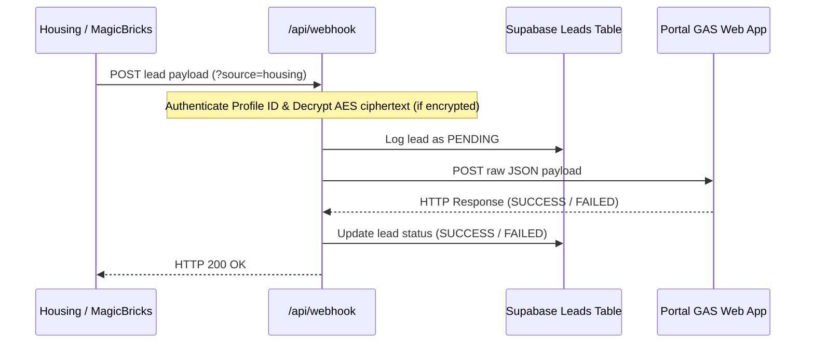
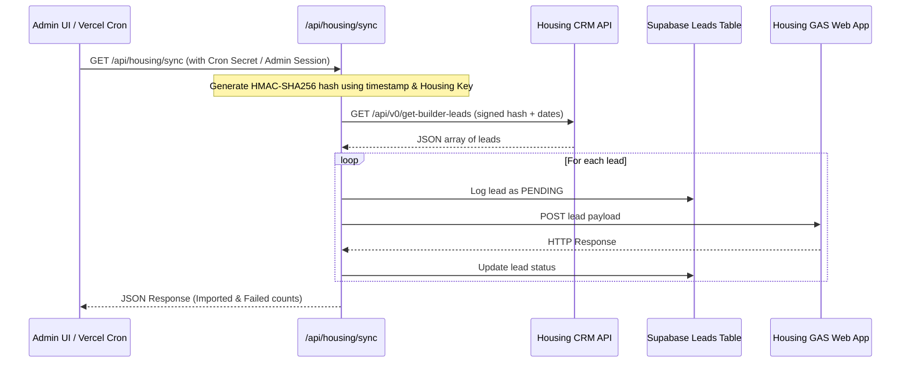

# Lead Redirector Dashboard

Permanent webhook middleman and API synchronizer for property portals (Housing.com, MagicBricks, etc.). Portals POST to a fixed Vercel URL; the app logs the lead to Supabase (or fallback stores), and forwards it to the correct Google Apps Script (GAS) URL. When you redeploy GAS, you only update the environment variables — never the portal configurations.

It supports both **Real-time Webhooks (New Method)** and **CRM Pull API Sync (Old Method)** for Housing.com.

---

## Architecture & Flow

### 1. New Method: Real-time Webhooks (Push)
The portal automatically pushes leads to your Vercel endpoint as they arrive. If the payload is encrypted, the middleware decrypts it, logs it, and forwards it to your sheet.



### 2. Old Method: CRM Pull API (Sync)
If webhook delivery is not supported or as a fallback, you can pull leads directly from Housing's database. This can be triggered manually from the dashboard or automatically using Vercel Cron Jobs.



---

## Integration Methods (Housing.com)

### A. New Method: Webhooks (Real-Time Push)
Configured through your Housing relationship manager or developer portal.
- **Webhook URL to provide**: `https://YOUR_APP.vercel.app/api/webhook?source=housing`
- **Supported Formats**: Accepts standard JSON, flat query params, or AES-encrypted payloads (under keys like `payload`, `data`, `encrypted_data`).

### B. Old Method: CRM API (Interval Pull)
For querying Housing's standard pull endpoints (`/api/v0/get-builder-leads` or `/api/v0/get-broker-leads`).
- **Trigger Manually**: Go to the **Admin Dashboard** → click **Sync Housing Leads**.
- **Automate with Cron**: Set up a Vercel Cron job targeting `/api/housing/sync` using the `CRON_SECRET` authorization header.

---

## Portal Webhook URLs (Fixed Targets)
Provide these exact URLs to the respective property portals. Replacing `YOUR_APP.vercel.app` with your deployed Vercel domain:

- **Housing**: `https://YOUR_APP.vercel.app/api/webhook?source=housing`
- **MagicBricks**: `https://YOUR_APP.vercel.app/api/webhook?source=magicbricks`
- **99acres / Others**: `https://YOUR_APP.vercel.app/api/webhook?source=99acres`

---

## Supabase Setup (Lead Storage)

1. Create a project at [supabase.com](https://supabase.com).
2. Go to the **SQL Editor** and run the query found in [supabase/schema.sql](file:///c:/Users/HP/Downloads/lead%20redirector/dashboard/supabase/schema.sql).
3. Go to **Project Settings → API** and copy:
   - **Project URL** $\rightarrow$ `SUPABASE_URL`
   - **service_role key** (secret) $\rightarrow$ `SUPABASE_SERVICE_ROLE_KEY`
   > [!WARNING]
   > Never expose the `service_role` key in your frontend client code or `VITE_*` environment variables.

---

## Environment Variables Configuration

Create a `.env` file in the `dashboard` directory based on the table below:

| Environment Variable | Required | Purpose |
| :--- | :--- | :--- |
| `ADMIN_PASSWORD` | Yes | Password for logging into the dashboard (min 8 characters). |
| `ADMIN_SESSION_SECRET` | Yes | A random string used to secure dashboard session cookies. |
| `HOUSING_GAS_URL` | Yes | Google Apps Script deployment URL for Housing leads sheet. |
| `HOUSING_PROFILE_ID` | Yes | Your Housing Profile ID (used to verify incoming webhooks & pull API requests). |
| `HOUSING_ENCRYPTION_KEY` | Yes | Housing API key (used for decrypting webhook payloads & signing pull requests). |
| `MAGICBRICKS_GAS_URL` | No | Google Apps Script deployment URL for MagicBricks leads. |
| `SUPABASE_URL` | No | Your Supabase project URL (e.g. `https://xxx.supabase.co`). |
| `SUPABASE_SERVICE_ROLE_KEY` | No | Server-only secret key for Supabase database access. |
| `CRON_SECRET` | No | Random token to secure the automated cron endpoint `/api/housing/sync`. |
| `VITE_PUBLIC_APP_URL` | No | Deployed application URL (e.g. `https://xxx.vercel.app`). Auto-displays webhook URLs in UI. |

---

## Local Development

1. Navigate to the dashboard directory:
   ```bash
   cd dashboard
   ```
2. Copy the sample environment file and fill in your keys:
   ```bash
   cp .env.example .env
   ```
3. Install dependencies:
   ```bash
   npm install
   ```
4. Run the local development server:
   ```bash
   npm run dev
   ```
5. Open [http://localhost:5173](http://localhost:5173) in your browser.
6. Use the **Test Webhook** tab to mock housing and magicbricks leads.

---

## Deploying to Vercel

### Option A: Via GitHub Integration (Recommended)
1. Push your code repository to GitHub (ensure the `dashboard` folder contains your root package configuration).
2. Go to [vercel.com](https://vercel.com) and **Import** the repository.
3. Set the **Root Directory** to `dashboard`.
4. Configure all environment variables in Vercel under **Settings → Environment Variables**.
5. Deploy the application.
6. Retrieve your project URL (e.g., `https://my-redirector.vercel.app`), update the `VITE_PUBLIC_APP_URL` environment variable, and redeploy to apply the change.

### Option B: Deploying via Vercel CLI
```bash
npm i -g vercel
vercel login
vercel
# Link project, add env variables, and deploy production:
vercel --prod
```

---

## Extending & Adding Custom Portals
To add a new portal (e.g., `99acres`):
1. Register the new source key in `lib/sources.ts`.
2. Define the corresponding forwarding variable (e.g., `ACRES_GAS_URL`) in Vercel.
3. Hand off the target URL to the portal:
   `https://YOUR_APP.vercel.app/api/webhook?source=99acres`

---

## Storage & Fallback Priority
1. **Supabase**: If `SUPABASE_URL` and `SUPABASE_SERVICE_ROLE_KEY` are provided, all logs and sync items are written here.
2. **Google Sheets GAS**: If Supabase is missing, falls back to appending logs via `LOGS_GAS_URL`.
3. **In-Memory Store**: If no external storage configuration is found, logs are kept in-memory for testing purposes (cleared on server restart).
